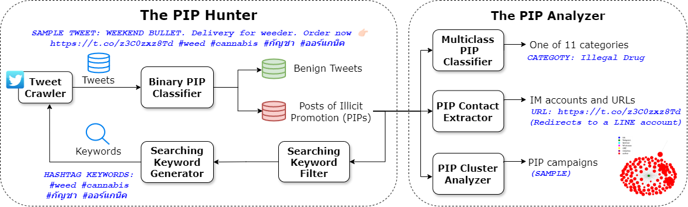

# Illicit-Promotion-on-Twitter

This is the repository that contains source code for the project [Illicit Promotion on Twitter](https://anonymous-illicit-promotion.github.io/). In this work, we present an extensive study of the promotion of illicit goods and services on Twitter, a popular online social network(OSN). 

### Code

In this repository, the source code of the project is released for reproduction and further usage, which includes:

- code for PIP hunting and analyzing tools as shown in the figure below.
- code for model training, testing and predicting. Particularly, 3 machine learning models are included, [the Binary PIP Classifier](./code/PIP_Hunter/Binary_PIP_Classifier/), [the Multiclass PIP Classifier](./code/PIP_Analyzer/Multiclass_PIP_Classifier/), and [the Contact Extractor](./code/PIP_Analyzer/PIP_Contact_Extractor/). 




### Data
As for data, we release the training and testing dataset of the machine learning models, as well as PIPs sampled from each illicit category. To avoid misuse by miscreants, the full dataset of PIPs and PIP-contacts will be provided upon request and background checking. Please contact the authors to request access.

### Directory structure
```
.
├─code
│  ├─PIP_Analyzer
│  │  ├─Multiclass_PIP_Classifier/
│  │  ├─PIP_Cluster_Analyzer/
│  │  └─PIP_Contact_Extractor/
│  └─PIP_Hunter
│      ├─Binary_PIP_Classifier/
│      ├─Searching_Keyword_Generator/
│      └─TweetCrawler/
└─data
    ├─groundtruth_dataset
    │  ├─Binary_PIP_Classifier/
    │  ├─Multiclass_PIP_Classifier/
    │  └─PIP_Contact_Extractor/
    └─PIP_sample_dataset/
```

